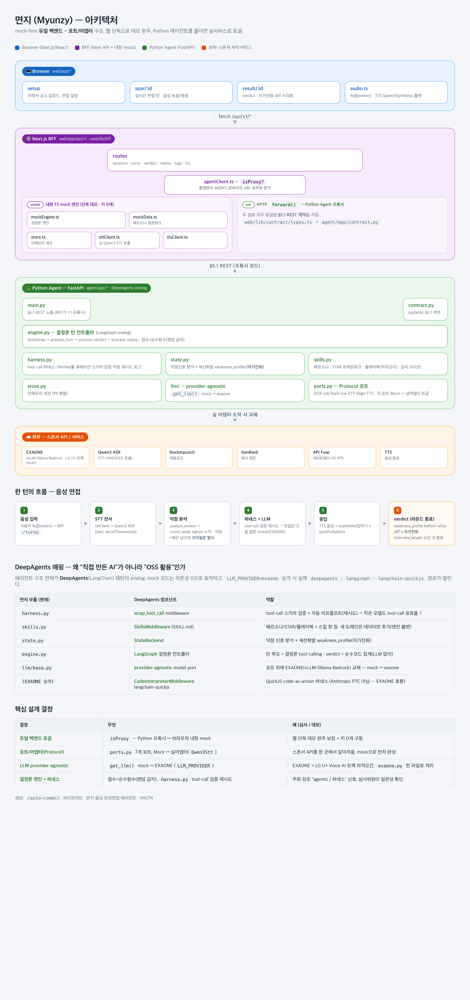

# 면지 (面zy / 면접 easy)

> 한 번뿐인 면접, 실전처럼 미리 겪어라.
> **OBA Weekendthon S1 · Team WIGTN** (김현상 · 김진모 · 손상우)

내 이력서와 실제 채용공고로 **AI 면접관을 자동 생성** → 음성/텍스트로 모의면접 →
상태기계 + 도구호출 **하네스**로 끝까지 일관 압박 → 답변 약점을 실시간 포착해 **꼬리질문** →
세션 내 **자가진화**(약점 학습) → 단어 타임스탬프·STAR 프레임워크 근거 피드백 + **분기 리플레이**.

---

## 핵심 아이디어 한 줄

> 작은 한국어 오픈 모델(**EXAONE-4.5**, 실연동)을 **도구호출 하네스**로 굴려, GPT급 자유연기 없이도
> 끝까지 일관되게 압박·평가·진화하는 면접관을 만든다. 부트스트랩은 **실제 DeepAgents 미들웨어**
> (`wrap_tool_call`·`write_todos`) 옵션으로 동작하고, 턴 루프는 결정론 하네스로 저지연·고신뢰를 지킨다.
> 키 0개 mock으로 전 기능 완주 — EXAONE/외부 API는 env만 켜면 무중단 승격.

---

## 아키텍처



> 인터랙티브 원본: [`docs/architecture.html`](docs/architecture.html) · Mermaid 버전: [`docs/ARCHITECTURE.md`](docs/ARCHITECTURE.md)

### 3-tier · 듀얼 백엔드 (mock-first)

```
[1] web/app        Next.js 16 / React 19 — 4 페이지 (setup · spar · result · /)
       │  §5.1 REST 계약  (web/lib/contract/types.ts ≡ agent/app/contract.py)
[2] web/lib/bff    BFF (Next API routes) ── agentClient.ts: isProxy?
       │      ├─ AGENT_SERVICE_URL 미설정 → 내장 TS mock 엔진 (단독 데모, 의존성 0)
       │      └─ 설정 → HTTP forward() ↓
[3] agent/app      Python / FastAPI — DeepAgents analog
            ├─ engine(컨트롤러) · harness(하네스) · skills(플레이북) · state(자가진화)
            ├─ ports.py  → OCR·Job·Rank·Gw·STT·Align·TTS  (Mock ↔ 실어댑터)
            └─ llm/      → mock | EXAONE (LLM_PROVIDER로 토글)
```

**mock-first 원칙**: 외부 8종 API/모델 없이도 전 기능이 mock으로 완주한다.
명세·키·EXAONE가 도착하면 **어댑터와 env만 교체** → 무중단 승격. (BFF ↔ Python 프록시 동작 검증 완료)

### DeepAgents 매핑 — "직접 만든 AI"가 아니라 "OSS 활용"

| 면지 모듈 | DeepAgents 컴포넌트 | 역할 |
|---|---|---|
| `harness.py` | **wrap_tool_call** middleware | tool-call 스키마 검증 + 자동 리프롬프트 → 작은 모델도 tool-call 유효율 ↑ |
| `skills.py` | **SkillsMiddleware** (SKILL.md) | 페르소나·STAR·플레이북 = 스킬 한 장. 새 도메인은 데이터만 추가(엔진 불변) |
| `state.py` | **StateBackend** | 약점 신호 분석 + 세션휘발 weakness_profile(자가진화) |
| `engine.py` | **LangGraph** 결정론 컨트롤러 | 턴 루프 = 결정론 tool-calling · verdict = 순수코드 집계 |
| `llm/base.py` | **provider-agnostic** model port | 포트 뒤에 EXAONE 교체 — mock ↔ exaone |

> mock 모드는 `deepagents` 의존성 0으로 동작. `HARNESS=deepagents` 로 켜면 **부트스트랩 컨텍스트
> 수집이 실제 `deepagents`·`langchain` 에이전트**(EXAONE 모델 + `wrap_tool_call`·`wrap_model_call`
> ·`TodoListMiddleware(write_todos)`) 위에서 돌고, 작업 로그에 그 발화가 그대로 노출된다.
> 실패/지연 시 결정론 수집으로 자동 폴백 → 데모 무중단. (턴 루프·질문 생성은 EXAONE 직접 호출로 불변)

---

## 주요 기능

| 기능 | 설명 | 구현 |
|---|---|---|
| **자동 면접관 생성** | 이력서 OCR + 채용공고 + 회사 평판 → Fit-Gap 공격포인트 + 4 페르소나(기술/컬처핏/임원/HR) | `engine.bootstrap` |
| **면접 단계 선택** | 사용자가 단계(기술/컬처핏/임원/HR)를 고르면 그 순서가 라운드 — 단계마다 다른 면접관 진행, 마지막에 종료 | setup 단계 선택 → `persona_sequence` |
| **플레이북 스왑** | 직무 키워드 감지 → backend/frontend/pm/general 플레이북 자동 선택 (FR-005) | `skills.detect_playbook` |
| **멀티라운드 + 꼬리질문** | 답변 약점 신호 포착 시 라운드당 최대 2회 꼬리질문. 각 단계는 같은 세션 누적정보(이력서·JD·직전 약점) 기반 | `engine.process_turn` |
| **자가진화** | 라운드별 약점 누적 → weakness_profile before→after diff. 단계가 달라도 직전 약점을 이어서 공략 | `state.update_weakness_profile` |
| **음성 면접 + 보이스 선택** | webm 녹음 → Qwen3 ASR 전사(단어 타임스탬프) → 머뭇거림·필러 분석. 면접관 TTS 보이스(여성/남성) 라디오 선택 | `sttClient.ts` / `ports.Qwen3Stt` / `ttsClient.ts` |
| **프롬프트 인젝션 방어** | 답변·이력서는 평가 대상 데이터로 격리, 지시 주입 거부 + 입력 길이 캡 | `llm/exaone.py`·`openai_llm.py` |
| **결정론 피드백** | 점수·합격확률·타이밍 메트릭 모두 순수함수(랜덤 금지) → 심사위원 일관성 확인 | `engine.process_verdict` |
| **분기 리플레이** | "그때 이렇게 답했다면?" 대안 답변 재시뮬레이션 | `engine.process_replay` |

---

## 빠른 시작

### A. 프론트만 — 단독 데모 (Python 불필요, 키 0개)

```bash
cd web
npm install
npm run dev          # http://localhost:3000  (BFF 내장 mock 엔진)
```

### B. 풀스택 — BFF → Python 에이전트

```bash
# 터미널 1 — 에이전트 서비스
cd agent
python -m venv .venv && source .venv/bin/activate
pip install -r requirements.txt
uvicorn app.main:app --port 8000 --reload      # LLM_PROVIDER=mock 기본

# 터미널 2 — web (프록시 모드)
cd web
cp .env.example .env       # AGENT_SERVICE_URL=http://localhost:8000 설정
npm install && npm run dev
```

### C. 외부 연동 (음성 · LLM)

- **음성 입력(STT)**: 브라우저 webm 녹음 → 전사 + 단어 타임스탬프 → 머뭇거림·필러 분석.
- **면접관 목소리(TTS)**: BFF가 HTTP TTS 서버를 대리 호출하는 **스트리밍 프록시(`/api/v1/tts`)를 직접 구현** — WAV를 받아 재생하고, 면접관 보이스를 라디오로 선택(여성/남성/박명수/유해진). 미설정·실패 시 브라우저 SpeechSynthesis로 자동 폴백.
- **LLM**: EXAONE-4.5(OpenAI 호환 + Hermes tool-call) 실연동, 미설정 시 mock 폴백.

> 실제 엔드포인트·키는 공개하지 않으며 각 서비스의 `.env`(gitignore)에만 둡니다.

---

## 프로젝트 구조

```
oba-weekendthon/
├─ web/                       Next.js 16 / React 19
│  ├─ app/                    setup · spar/[id] · result/[id] · api/v1/*
│  └─ lib/
│     ├─ bff/                 agentClient(분기) · mockEngine · sttClient · ttsClient · store
│     └─ contract/types.ts    §5.1 REST 계약 (Python contract.py와 동기)
├─ agent/                     Python / FastAPI (DeepAgents analog)
│  └─ app/
│     ├─ main.py              §5.1 REST 엔드포인트
│     ├─ engine.py            턴 컨트롤러 (bootstrap/turn/verdict/replay)
│     ├─ harness.py           tool-call 하네스 (검증·재시도)
│     ├─ skills.py            페르소나·프레임워크·플레이북·길이 프리셋
│     ├─ state.py             약점 분석 + 자가진화 weakness_profile
│     ├─ store.py             인메모리 세션 (PII 휘발)
│     ├─ ports.py             외부 8종 포트 + Mock/실 어댑터
│     ├─ contract.py          pydantic §5.1 계약
│     ├─ harness_da.py        실제 DeepAgents 부트스트랩 (HARNESS=deepagents)
│     └─ llm/                 base · mock · exaone(실연동) · openai_llm
└─ docs/
   ├─ architecture.html       손배치 아키텍처 (이 README의 PNG 원본)
   ├─ ARCHITECTURE.md         Mermaid 다이어그램
   ├─ prd/                    PRD · STT/TTS 명세 · 화면정의서
   └─ architecture/AGENT_ARCHITECTURE.md
```

---

## 기술 스택

- **Frontend**: Next.js 16, React 19, TypeScript, 서버사이드 BFF
- **Agent**: Python 3.14, FastAPI, pydantic v2, httpx — DeepAgents/LangGraph 패턴
- **LLM**: **EXAONE-4.5** (LG U+ 오픈 모델, OpenAI 호환 vLLM, Hermes tool-call) — 실연동, mock 폴백
- **에이전트 하네스**: DeepAgents · LangGraph · langchain (`HARNESS=deepagents` 시 부트스트랩 실동작)
- **음성**: Qwen3 ASR (STT, 단어 타임스탬프) + Qwen3-TTS (보이스 선택) / SpeechSynthesis 폴백
- **외부 포트**: MISO(OCR) · Rocketpunch(공고) · GenRank(평판) · API Fuse(게이트웨이) — 어댑터 통합(키 연결 시 실동작)

---

## 심사 신호 (가시화 지점)

CLAUDE.md 심사기준상 **API·OSS 활용도가 이중 가중치(최重)** — 이를 정면으로 겨냥한다.

- **agentic / 자동 / 하네스**: 작업로그 패널에 `ocr → job → fitgap → persona → playbook → harness.validate/retry → tool → followup.fire → evolve.diff` 실시간 방출
- **self-evolving (창의성)**: `EvolveDiff` — R1 약점 → R2 전략 before/after, 세션 내 학습
- **API·OSS 활용도**: **EXAONE-4.5(LG U+ Voice AI 트랙) 실연동** + 실제 **DeepAgents·LangGraph** 미들웨어 + **Qwen3 STT/TTS** + MISO/Rocketpunch 어댑터. mock·폴백은 `[mock]` 배지로 **정직하게** 표시
- **빌더 임팩트**: "플레이북 한 벌 추가 = 새 도메인" — 연봉협상·세일즈 등으로 확장 가능한 하네스

---

## 스코프 현황

- ✅ `web/` 프론트 4페이지 + BFF(§5.1) + TS mock 엔진 + 면접 단계 선택·음성 보이스 선택
- ✅ `agent/` Python 서비스 — 하네스·엔진·포트·플레이북·면접단계·자가진화
- ✅ **EXAONE-4.5 실연동** (`llm/exaone.py`, OpenAI 호환 + Hermes tool-call, mock 폴백)
- ✅ **실제 DeepAgents 부트스트랩** (`harness_da.py`, `HARNESS=deepagents` — wrap_tool_call·write_todos)
- ✅ 음성 STT/TTS 실연동 (`Qwen3Stt` / `ttsClient`) — 실 서버 ↔ 폴백
- ✅ 프롬프트 인젝션 방어 가드
- ⏳ 외부 실어댑터(MISO/Rocketpunch/GenRank/API Fuse) — 키 연결 시 `ports.py` provider 토글

---

자세한 기획: [`docs/prd/PRD_myeonji.md`](docs/prd/PRD_myeonji.md) ·
에이전트 설계: [`docs/architecture/AGENT_ARCHITECTURE.md`](docs/architecture/AGENT_ARCHITECTURE.md)
