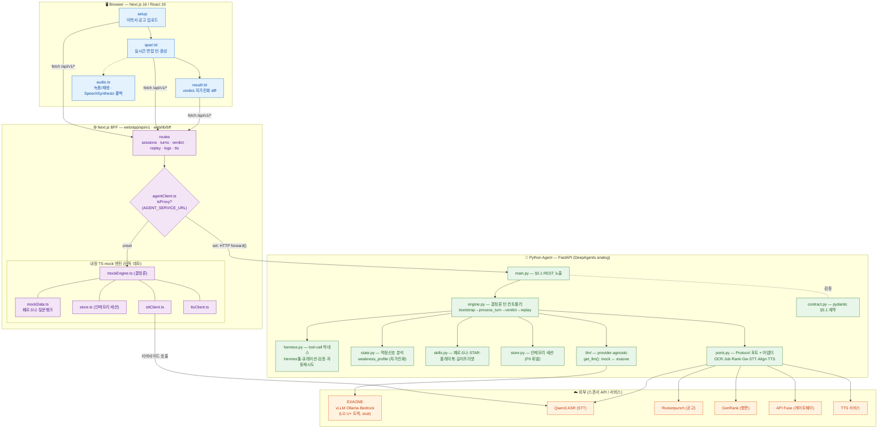
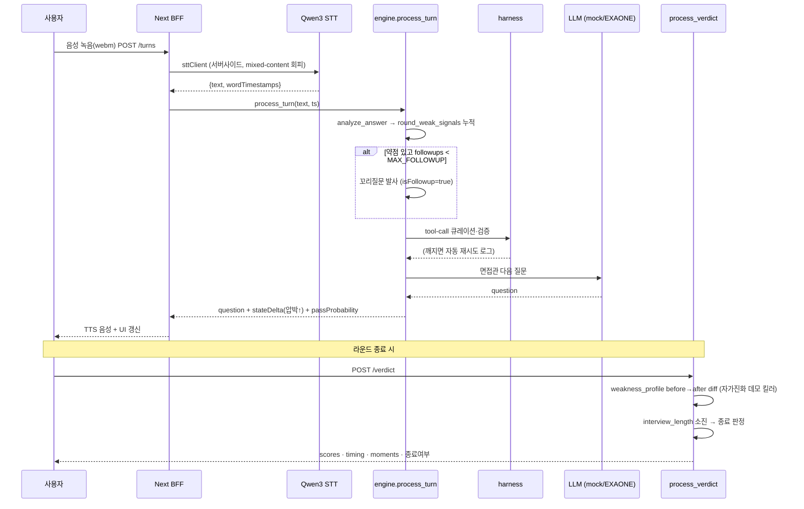

# 면지(Myunzy) — 아키텍처

> mock-first **듀얼 백엔드** + **포트/어댑터** 구조. 웹 단독으로 데모 완주, Python 에이전트 붙이면 실서비스로 토글.

## 1. 시스템 구성도



**듀얼 백엔드 토글** — `agentClient.ts`의 `isProxy`:
`AGENT_SERVICE_URL` **있으면** Python 에이전트로 HTTP 프록시, **없으면** 브라우저 내장 `mockEngine.ts`로 단독 완주. 두 경로 모두 동일한 §5.1 계약(`types.ts` ≡ `contract.py`)을 지킨다.

## 2. 한 턴의 흐름 (음성 면접)



## 3. 핵심 설계 결정

| 결정 | 무엇 | 왜 (심사/데모) |
|---|---|---|
| **듀얼 백엔드 토글** | `isProxy` — Python 프록시 ↔ 브라우저 mock | 웹 단독 데모 완주 보장 + 키 0개 구동 |
| **포트/어댑터(Protocol)** | `ports.py` 7개 포트, Mock ↔ 실어댑터(`Qwen3Stt`) | 스폰서 API를 한 곳에서 갈아끼움 |
| **LLM provider-agnostic** | `get_llm()` mock ↔ EXAONE (`LLM_PROVIDER`) | EXAONE = LG U+ Voice AI 트랙 자격요건, `exaone.py` 한 파일로 격리 |
| **결정론 엔진 + 하네스** | 점수=순수함수(랜덤 금지), `harness.py` tool-call 검증·재시도 | 주최 강조 "agentic / 하네스" 신호 |
```

