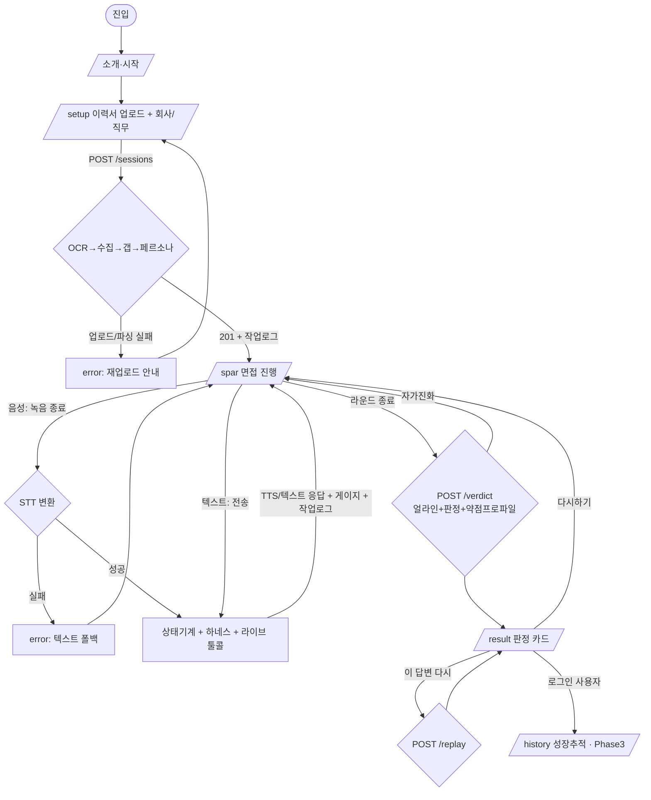

# 면지 (面zy / 면접 easy) PRD

> **Version**: 1.0
> **Created**: 2026-05-30
> **Status**: Draft
> **Project**: OBA Weekendthon — Season 1
> **Team**: WIGTN (김현상 · 김진모 · 손상우)
> **Codename**: 면지 (Interview Sparring)
> **Tracks**: LG U+ (EXAONE + Voice AI) · GS네오텍 (MISO) · GGUI (보너스)

---

## 1. Overview

### 1.1 Problem Statement
면접은 인생을 좌우하지만 본 무대는 **단 한 번**이고, 제대로 연습할 곳이 없다. 혼자 예상질문을 외워도 실전의 압박은 재현되지 않아, 막상 면접관 앞에서는 머뭇거리거나 두루뭉술하게 답하다 끝난다. 스터디·지인 모의면접은 상대가 끝까지 일관되게 까칠하지 않고, **내 이력서와 지원 회사에 맞는 날카로운 꼬리질문**도 못 한다. 끝나도 "왜 부족했는지", 무엇을 어떻게 고쳐야 하는지 **근거 있는 피드백**을 받지 못한다. 결국 가장 중요한 대화를 한 번도 리허설하지 못한 채 실전에 들어간다.

### 1.2 Goals
- 사용자가 **본인 이력서·자소서와 지원 회사 채용공고로 자동 생성된 AI 면접관**과 실전 전에 음성/텍스트로 모의면접을 한다.
- 면접관이 **상태기계 + 도구호출 하네스** 위에서 끝까지 일관되게, 현실적으로 압박한다 (자유연기로 무너지지 않음).
- 면접관이 라운드를 거치며 **사용자 약점을 학습해 다음 라운드에 더 집중 공략**한다 (세션 내 self-evolving).
- 면접관이 대화 중 **실제 데이터를 툴콜로 인출**해 근거로 압박한다 (블러핑 X).
- 끝나면 **단어 타임스탬프 + 프레임워크 근거**의 다차원 피드백 + Fit Gap 리포트를 받는다.
- 무대에서 **에이전트의 자율 동작(OCR→조회→갭분석→페르소나생성→툴콜)을 작업 로그로 가시화**한다 (심사 핵심 신호: agentic / 자동 / 하네스).
- 작은 한국어 LLM(**EXAONE**)이 도구 하네스 위에서 위 전부를 안정적으로 수행함을 증명한다.

### 1.3 Non-Goals (Out of Scope)
- ❌ **음성 톤/감정(prosody) 분석** — 한국어 SER 신뢰도 낮음, ROI 나쁨. (단어 타임스탬프로 머뭇거림만 측정)
- ❌ **사투리 인식/생성** — STT 정확도 하락 = 데모 사고 위험.
- ❌ **화자 분리(diarization)** — 턴 경계는 앱이 이미 안다.
- ❌ **모델 자체 학습/파인튜닝** — 외부 API 사용. 차별점은 하네스이지 모델 무게가 아님.
- ❌ **실시간 스트리밍 토큰 타임스탬프** — 얼라이너는 라운드 종료 후 1회 후처리.
- ❌ 면접 외 시나리오(연봉/이별/갑질 등) — 엔진은 공용이나 **이번 릴리스는 면접 단일 도메인**에 집중 (확장 백로그는 부록 A).

### 1.4 Scope
| 포함 (In) | 제외 (Out) |
|---|---|
| 이력서·자소서 업로드 → OCR 파싱 | 음성 감정·톤 분석 |
| 회사·직무 컨텍스트 자동 수집 (채용공고/평판) | 사투리 |
| Fit Gap 분석 (이력서↔JD) → 공격 포인트 | 화자 분리 |
| 멀티 페르소나 면접관 자동 생성 (기술/컬처핏/임원/HR) | 모델 파인튜닝 |
| 음성/텍스트 듀얼 모드 모의면접 | 실제 화상/통신망 면접 연동 |
| 상태기계 + 도구호출 하네스 (검증·재시도·큐레이션) | 면접 외 도메인 (이번 릴리스) |
| 대화 중 라이브 툴콜 (근거 인출) | 다국어 (한국어 우선) |
| 세션 내 자가진화 (약점 학습 → 집중 공략) | |
| 에이전트 작업 로그 패널 (하네스 가시화) | |
| 단어 타임스탬프 기반 머뭇거림/속도 지표 | |
| 프레임워크 근거 다차원 피드백 + Fit Gap 리포트 | |
| 합격 확률/점수 실시간 게이지 | |
| 분기 리플레이 (counterfactual) | |
| 난이도 에스컬레이션 + 커브볼 | |

---

## 2. User Stories

### 2.1 Primary User
- As a **취준생/이직자**, I want to **내 이력서와 지원 회사로 만들어진 AI 면접관과 음성으로 모의면접**해서, **실전에서 덜 당황하고 합격에 가까워지고 싶다.**
- As a **연습하는 사용자**, I want to **끝나고 무엇을 못했는지 머뭇거린 순간·부족한 근거까지 짚은 피드백을 받아서**, **다음 라운드에 즉시 고쳐보고 싶다.**
- As a **연습하는 사용자**, I want to **면접관이 라운드마다 내 약점을 더 파고드는 경험**으로, **실전 압박에 단련되고 싶다.**

### 2.2 Acceptance Criteria (Gherkin)

```gherkin
Scenario: 이력서 업로드 → 면접관 자동 생성
  Given 사용자가 이력서 PDF를 업로드하고 "토스 / 백엔드"를 입력했다
  When 세션을 시작하면
  Then OCR로 이력서가 파싱되고
  And Rocketpunch로 실제 채용공고가 수집되며
  And Fit Gap 에이전트가 이력서↔JD 갭에서 공격 포인트를 추출하고
  And 기술/컬처핏/임원/HR 페르소나 면접관이 자동 생성된다
  And 각 단계가 에이전트 작업 로그 패널에 실시간 표시된다

Scenario: 음성 모의면접 1턴
  Given 음성 모드로 면접이 진행 중이다
  When 사용자가 마이크로 답변하고 발언을 마치면
  Then STT가 답변을 텍스트로 변환하고
  And 면접관이 상태기계+하네스에 따라 일관된 입장으로 꼬리질문(TTS+텍스트)하며
  And 면접관은 답변 중 채용공고/이력서를 툴콜로 조회해 실제 근거로 압박한다

Scenario: 세션 내 자가진화 (눈에 보이는 진화)
  Given 1라운드에서 사용자가 특정 약점(예: 두루뭉술한 답변, 성급한 동의)을 2~3턴에 걸쳐 보였다
  When 라운드가 종료되어 약점 프로파일이 갱신되고 2라운드가 시작되면
  Then 면접관이 그 약점을 집중 공략하는 질문으로 전략을 조정하고
  And 작업 로그 패널에 약점 프로파일 before/after diff가 표시된다 ("R1: 두루뭉술 0.7 → R2 전략: 정량근거 강제")
  And 1R 질문과 2R 질문이 화면에 나란히 대비되어 "무엇이 달라졌는지" 보인다
  And 2R의 질문은 1R에서 측정된 약점 신호에 매핑되어 추적 가능하다

Scenario: 라운드 종료 후 피드백
  Given 한 라운드가 종료되었다
  When 피드백을 (자동) 요청하면
  Then 다차원 점수(목표달성/근거력/감정조절/타이밍/단호함)와
  And 단어 타임스탬프 기반 머뭇거림 지표("3.8초 망설인 뒤 사과")와
  And 프레임워크 근거(STAR 구조 누락 등)와 Fit Gap 리포트가 카드로 표시된다

Scenario: 분기 리플레이
  Given 판정 화면에서 특정 답변 순간을 선택했다
  When "이 답변 다시 해볼게" 대안을 제시(또는 AI 모범안 생성)하면
  Then 그 분기를 재시뮬레이션해 대안 전개와 결과 차이를 보여준다

Scenario: 도구호출 검증 실패 시 자동 복구
  Given LLM이 깨진 형식의 tool-call을 반환했다
  When 하네스가 스키마 검증에 실패하면
  Then 자동 리트라이/리프롬프트로 유효한 호출을 얻고, 사용자는 끊김을 못 느낀다

Scenario: 외부 API 장애 시 graceful degradation
  Given 음성 STT 업스트림이 응답하지 않는다
  When 사용자가 발언을 마치면
  Then 텍스트 입력 폴백을 제안하고 면접은 계속 진행된다
```

### 2.3 User Roles

| Role Key | 한국어 명칭 | 권한 범위 | 비고 |
|----------|------------|----------|------|
| `guest` | 비로그인 체험자 | 이력서 업로드·면접·일회성 결과 열람 (세션 휘발) | 데모 기본 경로 |
| `author` | 로그인 사용자 | 본인 세션·결과·성장 프로파일 read/write | Phase 3 |

**규칙**: 해커톤 데모는 `guest` 단독으로 전부 동작 (로그인 없이). 업로드한 이력서는 세션 종료 시 폐기. `author`/성장 프로파일은 Phase 3.

---

## 3. Functional Requirements

| ID | Requirement | Priority | Dependencies |
|----|------------|----------|--------------|
| FR-001 | 면접 세션 시작 (모드 voice/text, 난이도) | P0 (Must) | - |
| FR-002 | 이력서·자소서 업로드 → OCR 파싱 (MISO Document MCP) | P0 | EXT-OCR |
| FR-003 | 회사·직무 컨텍스트 수집 (Rocketpunch/GenRank/API Fuse) | P0 | EXT-JOB, EXT-RANK, EXT-GW |
| FR-004 | Fit Gap 에이전트: 이력서↔JD 대조 → 공격 포인트 추출 | P0 | FR-002, FR-003, EXT-LLM |
| FR-005 | 멀티 페르소나 면접관 자동 생성 (기술/컬처핏/임원/HR) | P0 | FR-004 |
| FR-006 | 음성 입력: 브라우저 녹음 → STT(Qwen3-ASR) 변환 | P0 | EXT-STT |
| FR-007 | 텍스트 입력(채팅) 모드 | P0 | - |
| FR-008 | 상대역 엔진: 상태기계 + 도구호출 하네스(검증·재시도·큐레이션·단일스텝) | P0 | EXT-LLM, EXT-TOOL |
| FR-009 | 상대역 응답 출력: TTS 음성 + 텍스트 (음성), 텍스트 (채팅) | P0 | EXT-TTS |
| FR-010 | 대화 중 라이브 툴콜 (이력서/채용공고/평판 실시간 인출 후 압박) | P0 | FR-008, EXT-* |
| FR-011 | **세션 내 자가진화**: 라운드별 약점 학습(최소 2~3턴 윈도우) → 다음 라운드 집중 공략, **약점 프로파일 before/after diff를 가시화** | P0 | FR-008, FR-014 |
| FR-012 | **에이전트 작업 로그 패널**: 하네스/툴콜/판단 + **자가진화 diff(`R1 두루뭉술 0.7 → R2 전략: 정량근거 강제`)** 실시간 가시화 | P0 | FR-008, FR-011 |
| FR-013 | 포스 얼라이너로 사용자 발화 단어 타임스탬프 추출 (라운드 후처리) | P0 | EXT-ALIGN, FR-006 |
| FR-014 | 피드백 엔진: 다차원 점수 + 타임스탬프 지표 + 프레임워크 근거 + Fit Gap 리포트 | P0 | FR-013, FR-008 |
| FR-015 | **합격 확률/점수 실시간 게이지** | P1 (Should) | FR-008 |
| FR-016 | **분기 리플레이**: 특정 답변 순간 대안으로 재시뮬레이션 | P1 | FR-008 |
| FR-017 | 난이도 에스컬레이션 + 커브볼 (잘하면 면접관이 세짐) | P1 | FR-008, FR-011 |
| FR-018 | 세션 transcript·결과 조회 (단일 세션) | P1 | - |
| FR-019 | 안전장치: 자해/위기 신호 감지 시 도움 연락처 카드 | P2 (Could) | - |
| FR-020 | 성장 엔진: 세션 누적 약점 프로파일 + 약점 공략 상대 (`author`) | P2 | FR-014, `author` |
| FR-021 | 역할 바꾸기: 사용자가 면접관, AI가 지원자 연기 | P3 (Won't, 이번 제외) | FR-008 |

---

## 4. Non-Functional Requirements

### 4.0 Scale Grade
**선택: Hobby (해커톤 데모)** — 동시접속 수십 명 이하, 데모 안정성 최우선. 외부 LLM/STT/TTS/OCR API 비용·레이트리밋은 사용자가 제공하는 명세에 종속.

| 등급 | DAU | 동시접속 | 데이터량 | 인프라 |
|------|-----|---------|---------|--------|
| **Hobby** ✅ | < 1,000 | < 100 | < 1GB | 단일 서버 / 서버리스, 무료~저비용 |

### 4.1 Performance SLA
| 지표 | 목표값 | 비고 |
|------|--------|------|
| 사용자 발언 종료 → 면접관 응답 시작 (음성) | p95 < **3초** | STT + LLM + (툴콜) + TTS 합산 |
| 텍스트 모드 응답 | p95 < **2초** | TTS 생략 |
| 세션 시작(OCR→수집→갭→페르소나 생성) | p95 < **10초** | 작업 로그로 진행 가시화하여 체감 완화 |
| 라운드 종료 → 피드백 카드 표시 | p95 < **6초** | 얼라이너 후처리 + 피드백 생성 |
| 분기 리플레이 생성 | p95 < **5초** | |

> ⚠️ 외부 API 레이턴시에 종속. 명세 수신 후 실측·튜닝. 핫스팟+유선 백업 권장.

### 4.2 Availability SLA
| 등급 | Uptime | 비고 |
|------|--------|------|
| Hobby | 95% (데모 시간 한정 100% 목표) | 외부 API 장애 시 graceful degradation (음성 실패→텍스트 폴백, 실API 실패→mock 폴백) |

### 4.3 Data Requirements
| 항목 | 값 |
|------|-----|
| 현재 데이터량 | < 100MB (세션 transcript + 단기 오디오 + 업로드 서류) |
| 오디오/서류 보존 | 라운드 얼라인·파싱 후 폐기. 기본: 세션 종료 시 삭제 |
| 데이터 보존 기간 | 데모: 세션 단위 휘발 / Phase 3: 사용자별 영구 |

### 4.4 Recovery
| 항목 | 기본값 |
|------|--------|
| RTO | 데모 한정 — 즉시 재시작 (상태 휘발 허용) |
| RPO | 진행 중 세션 손실 허용 (재시작) |

### 4.5 Security & Privacy
- **API 키 보호**: 모든 외부 API(OCR/STT/얼라이너/LLM/TTS/채용·평판) 키는 **백엔드(서버리스 프록시) 환경변수에만** 보관. 프론트엔드 노출 절대 금지.
- **실시간 음성 API(있을 경우)**: 클라이언트 직결 필요 시 백엔드가 **단기 토큰(ephemeral token)** 발급만 담당.
- **이력서 = 민감 PII**: 업로드 동의 UI, 세션 휘발 기본, 영구 저장은 opt-in(Phase 3). 외부 API 전송 최소화·마스킹 고려.
- **녹음 동의**: 음성 녹음 시작 전 명시적 동의 UI.
- **안전장치**: 자해/위기 신호 감지 시 연습 대신 도움 연락처 카드 (윤리 가산점).
- Authentication: Optional (guest 기본), Required for 성장 프로파일(Phase 3).

---

## 5. Technical Design

### 5.0 외부 서비스 연동 계약 (External Service Contracts)

> ⚠️ **중요**: 대부분의 외부 서비스는 **사용자가 별도 서버에서 명세서를 전달**한다. 아래는 우리 시스템이 기대하는 인터페이스이며 실제 엔드포인트·인증·필드명은 **명세 수신 시 확정(TBD)**. 백엔드는 이 계약에 맞춰 **어댑터(포트)**를 두고, 명세 도착 전에는 **mock 구현**으로 개발한다 (명세 변경 시 어댑터만 교체 → 1박2일 병렬 개발의 핵심).
>
> ⛔ **예외 (mock-first 비대상)**: **EXT-LLM(EXAONE)** 은 명세 대기 대상이 **아니다**. EXAONE은 **공개 오픈모델**(HuggingFace / AWS Bedrock / 로컬 구동, 키·계정 불필요)이라 **Phase 1 시작부터 실 모델로 직접 연결**한다. 이유: ① "작은 모델이 하네스 위에서 일관 동작"이라는 **핵심 차별점은 mock LLM으로 증명 불가**(mock은 항상 완벽한 tool-call을 뱉어 재시도·검증 하네스가 무대에서 증명되지 않음). ② **LG U+ 트랙 자격요건이 EXAONE 실활용**. Hermes 도구 파싱도 EXAONE에 직접 적용한다.

> **Real-by-demo 티어**: 데모에서 *실제로* 점수가 되는 건 mock이 아니라 실연동이다(활용도 = 이중 가중치 최重축). 행사 당일 즉시 사용 가능한 것을 **Tier-A(실연동 필수/우선)**, 명세 의존도 높은 것을 **Tier-B(mock 허용)** 로 분리한다.

| Ref | 서비스 | 역할 | 입력 | 출력 | Real-by-demo | 상태/비고 |
|-----|--------|------|------|------|:---:|------|
| **EXT-LLM** | EXAONE 에이전트 | 한국어 대화·상대역·추론 | messages + tool schema | message / tool_call | 🟢 **A-필수** | 공개 오픈모델, **mock 제외 / Phase 1 실연동** |
| **EXT-TOOL** | Hermes function calling | tool-call 생성/파싱 | messages + tools | 구조화 tool_call(JSON) | 🟢 **A-필수** | EXT-LLM(EXAONE)에 통합 |
| **EXT-OCR** | GS네오텍 MISO — Document MCP | 이력서/자소서 파싱(OCR) | 파일(pdf/img) | 구조화 텍스트(경력/스킬/프로젝트) | 🟢 **A-필수** | 계정 사전 발급됨 → GS 트랙 자격 |
| **EXT-JOB** | Rocketpunch API | 채용공고·회사 이벤트 조회/검색 | 회사/직무 키워드 | JD·요구스킬·우대조건·게시물 | 🟡 **A-택1** | 키 현장배포. "실데이터 인용"의 핵심 소스 |
| **EXT-GW** | API Fuse (16 API 단일키) | 뉴스/지도/법령 등 보조 컨텍스트 | 쿼리 | 도메인별 결과 | 🟡 **A-택1** | 셀프가입(platform.apifuse.ai) |
| **EXT-RANK** | GenRank (read-only REST) | 회사/업계 합의 랭킹·평판 | 카테고리/회사 | 랭킹·평판 신호 | ⚪ A-선택 | 바로 사용(read-only) |
| **EXT-STT** | Qwen3-ASR 1.7B (API) | 음성→텍스트 | 오디오(wav/webm), lang=ko | transcript(text) | 🔵 B-mock허용 | 명세 TBD |
| **EXT-ALIGN** | 포스 얼라이너 (API) | 단어 타임스탬프 | 오디오 + transcript | `[{word,start,end}]` | 🔵 B-mock허용 | 명세 TBD (STT word-ts로 폴백 가능) |
| **EXT-TTS** | TTS (유료 API) | 텍스트→음성 | text, voice | audio(url/stream) | 🔵 B-mock허용 | 명세 TBD |

> 🎯 **데모 합격선 (반드시 실연동)**: **EXAONE(LLM) + MISO(OCR) + Tier-A 택1(Rocketpunch 또는 API Fuse)** = 최소 3개 실연동. 이 3개가 LG U+·GS 트랙 자격 + 활용도 점수의 바닥선이다. 나머지(STT/얼라이너/TTS)는 명세 미수신 시 mock 폴백 허용하되, **mock으로 동작하는 소스는 면접관 발화에서 "실제 인용"으로 포장하지 않고 작업 로그에 `[mock]` 배지를 노출**한다(정직성 = 빌더 임팩트).

#### 내부 추상 인터페이스 (포트 — 명세 수신 시 매핑)
```ts
interface OcrPort   { parse(file: Blob): Promise<ResumeDoc> }                       // ResumeDoc = {sections, skills, projects, raw}
interface JobPort   { search(company: string, role: string): Promise<JobPosting[]> }
interface RankPort  { reputation(company: string): Promise<RankSignal> }
interface GwPort    { query(api: string, params: object): Promise<unknown> }        // API Fuse 통합
interface SttPort   { transcribe(audio: Blob, opts:{lang:'ko'}): Promise<{text:string}> }
interface AlignPort { align(audio: Blob, transcript: string): Promise<WordTs[]> }   // WordTs = {word,start,end}
interface LlmPort   { chat(messages: Msg[], tools?: ToolSchema[]): Promise<LlmResult> } // {text?, tool_call?}
interface TtsPort   { synthesize(text: string, opts:{voice:string}): Promise<{audioUrl:string}> }
```

### 5.1 API Specification (내부 API — 우리 백엔드)

> REST + (선택)WebSocket. 키 보관·외부 오케스트레이션은 전부 백엔드(서버리스 프록시)에서. 공통 에러 포맷은 §5.1.4.

#### `POST /api/v1/sessions`
**Description**: 새 면접 세션 시작 — 서류 업로드 + 회사/직무 입력 → 컨텍스트 수집 → 페르소나 생성
**Authentication**: Optional (guest 허용)
**Request**: `multipart/form-data`
| field | type | required | description |
|-------|------|----------|-------------|
| resume | file | yes | 이력서/자소서 (pdf/png/jpg) |
| company | string | yes | 지원 회사명 |
| role | string | yes | 지원 직무 |
| mode | string | yes | `voice` \| `text` |
| difficulty | number | no | 1~3, default 1 |
| interviewMeta | json | no | `{ time?, format?, rounds? }` |

**Response 201**:
```json
{
  "success": true,
  "data": {
    "sessionId": "string",
    "company": "string",
    "role": "string",
    "mode": "voice",
    "fitGap": { "attackPoints": ["대규모 트래픽 경험 부족", "..."] },
    "personas": [
      { "id": "tech", "name": "기술 면접관", "persona": "string", "openingLine": "string" },
      { "id": "culture", "name": "컬처핏 면접관", "persona": "string", "openingLine": "string" },
      { "id": "exec", "name": "임원", "persona": "string", "openingLine": "string" },
      { "id": "hr", "name": "HR", "persona": "string", "openingLine": "string" }
    ],
    "activedPersona": "tech",
    "round": 1,
    "agentLog": [ { "step": "ocr.parse", "status": "done" }, { "step": "job.search", "status": "done" }, { "step": "fitgap.analyze", "status": "done" }, { "step": "persona.build", "status": "done" } ]
  }
}
```
**Errors**: 400 INVALID_INPUT(회사/직무/파일 누락), 413 PAYLOAD_TOO_LARGE, 422 OCR_FAILED(파싱 실패), 429 RATE_LIMITED, 503 UPSTREAM_UNAVAILABLE.

#### `POST /api/v1/sessions/{id}/turns`
**Description**: 사용자 답변 1턴 제출 → 면접관 응답 (음성: 오디오 업로드 / 텍스트: text). 면접관은 필요 시 라이브 툴콜 수행.
**Request (voice)**: `multipart/form-data` — `audio` 파일
**Request (text)**: `{ "text": "string (required)" }`
**Response 200**:
```json
{
  "success": true,
  "data": {
    "userTurn": { "text": "string - STT 결과", "audioRef": "string|null" },
    "counterpartTurn": {
      "personaId": "tech",
      "text": "string",
      "audioUrl": "string|null - TTS (음성 모드)",
      "toolCalls": [ { "name": "lookup_job_posting", "summary": "채용공고 필수요건 조회" } ],
      "stateDelta": { "mood": "string", "pressure": 0.6, "hiddenAgendaRevealed": false }
    },
    "passProbability": 0.42,
    "agentLog": [ { "step": "harness.validate", "status": "done" }, { "step": "tool.lookup_job_posting", "status": "done" } ],
    "round": 1
  }
}
```
**Errors**: 422 STT_FAILED(인식 실패 → 텍스트 폴백 안내), 503 UPSTREAM_UNAVAILABLE.

#### `POST /api/v1/sessions/{id}/verdict`
**Description**: 라운드/세션 종료 → 피드백 판정 (얼라이너 후처리 + Fit Gap 리포트). 다음 라운드 자가진화 프로파일도 갱신.
**Response 200**:
```json
{
  "success": true,
  "data": {
    "scores": { "goalAchieved": 0.6, "evidence": 0.7, "composure": 0.5, "timing": 0.4, "assertiveness": 0.6 },
    "timingMetrics": { "avgResponseDelaySec": 3.8, "longestPauseSec": 5.1, "wordsPerSec": 2.1, "fillerCount": 7 },
    "framework": { "name": "STAR / 역량면접", "violations": ["STAR 구조 누락", "정량 성과 미제시"] },
    "fitGapReport": { "covered": ["..."], "stillWeak": ["대규모 트래픽 경험"] },
    "weaknessProfile": { "patterns": ["두루뭉술", "성급한 동의"], "nextFocus": "정량 근거 요구" },
    "moments": [ { "round": 1, "atSec": 42.0, "label": "성급한 동의", "quote": "아 네 맞습니다..." } ],
    "summary": "string - 한 줄 총평"
  }
}
```

#### `POST /api/v1/sessions/{id}/replay`
**Description**: 분기 리플레이 — 특정 순간 대안 답변으로 재시뮬레이션
**Request**: `{ "momentId": "string (required)", "alternativeUtterance": "string (optional) - 없으면 AI 모범안 생성" }`
**Response 200**:
```json
{ "success": true, "data": { "branchTranscript": [ {"speaker":"user|ai","text":"string"} ], "outcomeDelta": "string - 원래 대비 결과 차이", "passProbabilityDelta": 0.18 } }
```

#### `WS /ws/v1/sessions/{id}` (선택 — 저지연 + 작업 로그 스트리밍)
- 이벤트: `turn:partial`(STT 부분), `counterpart:audio`(TTS 청크), `state:update`(상태기계), `agent:log`(작업 로그 라이브), `gauge:update`(합격확률), `verdict:ready`.
- MVP는 REST로 충분. 작업 로그 패널의 라이브 연출이 필요하면 WS 우선 도입.

#### 5.1.4 Error Response Format (공통)
```json
{ "success": false, "error": { "code": "UPSTREAM_UNAVAILABLE", "message": "...", "details": [] }, "meta": { "timestamp": "ISO8601" } }
```
| Status | Code | When |
|--------|------|------|
| 400 | INVALID_INPUT | 필수 입력 누락/형식 오류 |
| 413 | PAYLOAD_TOO_LARGE | 업로드 파일 용량 초과 |
| 422 | OCR_FAILED / STT_FAILED | 파싱/인식 실패 → 폴백 안내 |
| 429 | RATE_LIMITED | 외부 API 한도 |
| 503 | UPSTREAM_UNAVAILABLE | 외부 서비스 장애 → mock/텍스트 폴백 |

### 5.1.1 도구호출 하네스 & Hermes Tool Schema

> **차별점**: 면접관을 자유연기시키지 않고 **상태기계 + 도구**로 굴린다. 작은 모델이 끝까지 일관되게 압박·평가·진화하도록 강제.
>
> 🏗️ **구현**: 하네스는 직접 짜지 않고 **DeepAgents 미들웨어**로 캡슐화 — `wrap_tool_call`(검증·재시도), `wrap_model_call`(상태·페르소나 주입), SkillsMiddleware(페르소나/프레임워크=SKILL.md), StateBackend(weakness_profile), subagents+write_todos(병렬 부트스트랩). 턴 루프는 얇은 **LangGraph 결정론 컨트롤러**가 구동. **verdict/리플레이만 QuickJS code-as-action**(+순수코드 폴백). 전체 설계: **docs/architecture/AGENT_ARCHITECTURE.md**

**하네스 기법**:
- **도구 큐레이션**: 페르소나/단계별 필요한 도구 5~8개만 노출.
- **단일 턴 = 단일 도구**: 복잡한 체이닝을 코드 하네스가 한 스텝씩 쪼개 모델에 먹임.
- **스키마 검증 + 재시도**: tool-call JSON 스키마 검증, 실패 시 자동 리프롬프트. (LLM이 guided decoding 지원 시 활용, 미지원이면 검증+재시도로 보완)
- **작업 로그 방출**: 모든 하네스 스텝/툴콜/판단을 `agent:log` 이벤트로 내보내 UI 패널에 가시화.

**Hermes Tool Set (JSON Schema 발췌)**:
```jsonc
[
  { "name": "parse_resume", "parameters": { "file_ref": "string" } },
  { "name": "lookup_job_posting", "parameters": { "company": "string", "role": "string" } },
  { "name": "lookup_company_reputation", "parameters": { "company": "string" } },
  { "name": "analyze_fit_gap", "parameters": { "resume_ref": "string", "job_ref": "string" } },
  { "name": "build_personas", "parameters": { "attack_points": "array", "company": "string" } },
  { "name": "set_counterpart_state", "parameters": { "persona_id": "string", "mood": "string", "pressure": "number", "hidden_agenda_revealed": "boolean" } },
  { "name": "lookup_playbook", "parameters": { "framework": "string" } },
  { "name": "check_answer_quality", "parameters": { "user_utterance": "string", "framework": "string" } },
  { "name": "update_weakness_profile", "parameters": { "round": "number", "signals": "array" } },   // 자가진화
  { "name": "escalate", "parameters": { "reason": "string", "level": "number" } },
  { "name": "estimate_pass_probability", "parameters": { "transcript_ref": "string" } },
  { "name": "generate_verdict", "parameters": { "transcript_ref": "string", "timing_metrics": "object" } },
  { "name": "simulate_branch", "parameters": { "moment_id": "string", "alternative": "string" } }
]
```

### 5.2 Database Schema
> 데모(guest)는 인메모리/세션 스토어로 충분. 영속 필요 시 SQLite/Postgres. Phase 3(성장 엔진)부터 영구화.

```
sessions(
  id PK, user_id NULL, company, role, mode, difficulty,
  resume_doc JSON,            -- OCR 파싱 결과 (세션 휘발)
  job_context JSON,           -- 채용공고/평판 수집 결과
  fit_gap JSON,               -- attackPoints
  personas JSON,              -- 생성된 면접관 패널
  weakness_profile JSON,      -- 자가진화 누적 (세션 내)
  status,                     -- active | ended
  created_at, ended_at
)
turns(
  id PK, session_id FK, round, speaker,       -- user | ai
  persona_id NULL, text, audio_ref NULL,
  word_timestamps JSON NULL,                  -- [{word,start,end}] (user 턴, 얼라인 후)
  tool_calls JSON NULL,                       -- 라이브 툴콜 기록
  answer_quality JSON NULL,                   -- check_answer_quality 결과
  created_at
)
verdicts(
  id PK, session_id FK, scores JSON, timing_metrics JSON,
  framework JSON, fit_gap_report JSON, weakness_profile JSON, moments JSON, summary, created_at
)
agent_logs(
  id PK, session_id FK, ts, step, status, detail JSON   -- 작업 로그 패널 소스
)
-- Phase 3
user_profiles( user_id PK, weakness_patterns JSON, history JSON, updated_at )
```

### 5.3 Architecture Diagram
```
[브라우저 웹앱 (Next/React)]
  ├─ 이력서 업로드 / MediaRecorder(녹음) / 채팅 입력
  ├─ 면접 화면(말풍선·페르소나 전환) · 합격확률 게이지 · 에이전트 작업 로그 패널
  ├─ 판정 카드 · 분기 리플레이
  │
  ▼ HTTPS / (선택)WS — 키 없음
[BFF / Next API (서버리스 프록시)]
  ├─ 내부 REST (§5.1 계약) 라우팅 · 세션/턴/판정/로그 저장
  ├─ 어댑터(포트) 中 mock-허용 소스 보유 가능 (프론트 병렬개발용)
  │
  ▼ 내부 REST (§5.1 계약 그대로)
[에이전트 서비스 (Python / FastAPI + DeepAgents)]   ← 상세: docs/architecture/AGENT_ARCHITECTURE.md
  ├─ LangGraph 턴 컨트롤러 (결정론 상태기계, FR-008)
  ├─ 미들웨어: SkillsMiddleware(페르소나/프레임워크=SKILL.md) · subagents+write_todos(부트스트랩)
  │           · wrap_tool_call(검증·재시도) · wrap_model_call(상태/페르소나 주입) · StateBackend(weakness_profile)
  ├─ CodeInterpreterMiddleware (QuickJS) — verdict/리플레이 전용 code-as-action (+ 순수코드 폴백)
  ├─ 라이브 툴콜 디스패처 (단일 턴=단일 도구)
  └─ 어댑터(포트): Ocr/Job/Rank/Gw/Stt/Align/Llm(EXAONE)/Tts  ← 키 env, 명세 전 mock (EXAONE 제외 실연동)
  │
  ▼ (키 보관 후 호출)
[외부 API: MISO · Rocketpunch · GenRank · API Fuse · Qwen3-ASR · 포스얼라이너 · EXAONE · TTS]
  ← 명세는 사용자가 다른 서버에서 전달 (도착 전 mock) · 모델 = EXAONE (vLLM/Ollama/Bedrock)

> ⚙️ **명명 주의**: "PTC(Programmatic Tool Calling)"는 Anthropic 전용 기능 → EXAONE엔 불가. 우리 구현은 **QuickJS 기반 code-as-action 하네스**. 발표·문서에서 "PTC" 금지. (근거: docs/architecture/AGENT_ARCHITECTURE.md §2)
```

### 5.4 Pages
| Route | Audience | Auth | Linked FRs | Has FE Components | Primary State | Responsive |
|-------|----------|------|-----------|-------------------|---------------|-----------|
| `/` | guest, author | Optional | FR-001 | Yes | success | Desktop / Mobile |
| `/setup` | guest, author | Optional | FR-001~005 | Yes | loading / success / error | Desktop / Mobile |
| `/spar/[sessionId]` | guest, author | Optional | FR-006~012, 015, 017 | Yes | loading / success / error | Desktop / Mobile |
| `/result/[sessionId]` | guest, author | Optional | FR-014, 016, 018 | Yes | loading / success / error | Desktop / Mobile |
| `/history` | author | Required (Phase 3) | FR-020 | Yes | empty / success / no-permission | Desktop / Mobile |
| `/api/v1/*` | - | Optional | FR-002~016 | **No** (API) | - | - |

### 5.4.1 Page State Matrix
| Route | loading | empty | error | success | no-permission | 비고 |
|-------|---------|-------|-------|---------|---------------|------|
| `/` | - | - | - | ✓ | - | 진입/소개·시작 CTA |
| `/setup` | ✓ | - | ✓ | ✓ | - | OCR/수집/페르소나 생성 중 loading(작업 로그 표시); 업로드/파싱 실패 → error |
| `/spar/[id]` | ✓ | - | ✓ | ✓ | - | 마이크 거부/STT 실패 → error 카피 + 텍스트 폴백 |
| `/result/[id]` | ✓ | - | ✓ | ✓ | - | 얼라인/판정 생성 중 loading; 분기 리플레이 부분 loading |
| `/history` | ✓ | ✓ | ✓ | ✓ | ✓ | 연습 0건 empty; 비로그인 접근 no-permission |

**상태 정의**: loading(외부 API 처리 중 — 작업 로그/스켈레톤), error(업로드·STT 실패/업스트림 장애 → 재시도·폴백), success(정상), empty(이력 0건), no-permission(미로그인 history 접근).

### 5.5 User Flow


---

## 6. Implementation Phases

> **개발 원칙: mock-first.** 8종 외부 API 명세가 도착하기 전에도 mock 어댑터로 전 기능을 굴린다. 명세 오는 족족 실어댑터로 교체 → 직렬 블로킹을 병렬화. 데모 직전 외부 API 장애 시에도 mock 폴백으로 100% 완주.

> **에이전트 관점 재배치**: 최대 novelty 리스크 = "EXAONE × code-as-action" → **데모 크리티컬 패스를 이 리스크에서 분리**. Phase 1은 검증된 tool-calling 경로 + 순수코드 verdict만, code-as-action은 Phase 2 enhancement. (상세: docs/architecture/AGENT_ARCHITECTURE.md §6)

### Phase 1: MVP (데모 코어 — 검증된 경로만) — 토 오후~밤
- [ ] 웹앱 셸 + 라우팅 (`/`, `/setup`, `/spar`, `/result`) — Next/TS
- [ ] 에이전트 서비스 셸 (Python/FastAPI + DeepAgents) + §5.1 REST 계약 연결
- [ ] **LangGraph 턴 컨트롤러 + `wrap_tool_call` 검증·재시도** (FR-008)
- [ ] **EXAONE 실연동 (Ollama/vLLM, mock 제외)** + Hermes 도구 파싱 — Phase 1 시작부터 (C-3)
- [ ] **SkillsMiddleware**: 페르소나(기술/임원…)·프레임워크(STAR…) = SKILL.md 로딩 (FR-005)
- [ ] **부트스트랩 = subagent 병렬 수집** + write_todos + StateBackend weakness_profile (FR-002~005, FR-011)
- [ ] 외부 어댑터(포트) 골격 + mock (Tier-B: STT/얼라이너/TTS) / **MISO(OCR)+Tier-A 택1 실연동** (C-4)
- [ ] 텍스트 면접 E2E (FR-007)
- [ ] 에이전트 작업 로그 패널 — LangGraph 스트리밍 이벤트 (FR-012)
- [ ] **verdict = 순수 코드(LLM 없이)** 타이밍 지표 집계 — 폴백 경로 먼저 확보 (FR-014 일부)
- [ ] 피드백 카드: 다차원 점수 + 프레임워크 근거 + Fit Gap 리포트 (FR-014)
**Deliverable**: 이력서 업로드 → (subagent 병렬 수집) 면접관 자동 생성 → 텍스트 모의면접 → 근거 피드백까지 도는 데모. 데모 합격선 실연동(EXAONE+MISO+Tier-A 택1) 충족.

### Phase 2: 음성 + 데모 킬러 (code-as-action 도입 = enhancement) — 토 밤~일 오전
- [ ] **verdict/리플레이를 QuickJS `CodeInterpreterMiddleware`로 승격** (스킬 번들 스크립트 import, 순수코드 폴백 유지) (FR-014, FR-016)
- [ ] 음성 입력(MediaRecorder→STT) + TTS 출력 (FR-006, FR-009)
- [ ] 대화 중 라이브 툴콜 (FR-010)
- [ ] 포스 얼라이너 → 단어 타임스탬프 머뭇거림 지표 (FR-013)
- [ ] **세션 내 자가진화** before/after diff 패널 (StateBackend diff 시각화) (FR-011, FR-017)
- [ ] **합격 확률 게이지** (FR-015)
- [ ] **분기 리플레이** ⭐ 데모 클라이맥스 (FR-016)
**Deliverable**: 음성으로 압박 면접 + 자가진화 + "이 답변 다시" + 실시간 게이지/작업로그까지 보여주는 임팩트 데모. (EXAONE이 code-as-action 실패해도 순수코드 폴백으로 100% 완주)

### Phase 3: 개인화/확장 (여유 시)
- [ ] 성장 엔진: 누적 약점 프로파일 + 약점 공략 상대 (FR-020, `author`)
- [ ] 세션 결과 조회/이력 (FR-018)
- [ ] 안전장치(위기 신호 카드) (FR-019)
- [ ] (보너스) GGUI 생성형 UI 연동 — 작업 로그/페르소나 패널 동적 렌더
**Deliverable**: 재방문 가치 있는 개인화 면접 코치.

### 실제 외부 API 통합 게이트
- [ ] 사용자로부터 OCR/채용·평판/STT/얼라이너/LLM/TTS **명세 수신**
- [ ] mock → 실어댑터 교체, 레이턴시 실측·튜닝, 키 env 주입, mock 폴백 유지

---

## 7. Success Metrics
| Metric | Target | Measurement |
|--------|--------|-------------|
| 데모 1회 완주율 (업로드→판정) | 100% (무대) | 리허설 로그 |
| 발언 종료→면접관 응답 (음성) | p95 < 3초 | 서버 타이밍 로그 |
| tool-call 유효율 (재시도 포함) | > 99% | 하네스 검증 로그 |
| 면접관 입장 일관성 (상태 위반 0) | 위반 0 | 상태기계 감사 |
| 자가진화 작동 (라운드별 약점 반영) | 2R 질문이 1R 약점 신호에 측정 가능하게 연동 + before/after diff 노출 | 질문-약점 매핑 테이블 증빙 + 작업로그 diff |
| 실연동 스폰서 API (데모 합격선) | EXAONE + MISO + Tier-A 택1 = 최소 3개 실동작 | 데모 네트워크 로그 |
| 피드백 근거성 (프레임워크/타임스탬프 인용) | 모든 판정에 ≥2개 근거 | 판정 출력 검수 |
| 심사 신호 노출 ("agentic/하네스/자동/self-evolving") | 데모·발표 내 명시 + 작업 로그 가시화 | 발표 스크립트·UI |

---

## 부록 A. 확장 백로그 (이번 릴리스 제외)
같은 엔진(플레이북 데이터 한 벌)으로 도메인만 추가:
| 시나리오 | 프레임워크 | 가치 |
|---|---|---|
| 연봉 협상 | BATNA/ZOPA | 실생활 이득 |
| 투자자 피칭 Q&A 방어 | 반론 프레이밍 | 스타트업 공감대 |
| 고객 컴플레인 응대 | LAST | 콜센터/CS 교육 시장 |
| 부정 피드백 주기 | SBI | 관리자/B2B 확장 |

> 확장 전략: 시나리오 = "플레이북(프레임워크 + 상대 상태 초기값 + 커브볼 풀)" 데이터 한 벌. 엔진/하네스 그대로 → 콘텐츠만 추가. **이것이 빌더 임팩트(피어리뷰 25%) 메시지**: "누구나 자기 도메인 면접관을 데이터 한 벌로 추가."

## 부록 B. 의사결정 로그
- 도메인 = **면접 단일** 집중 (엔진은 공용, 콘텐츠 확장은 백로그)
- 이름 = **면지 (面zy / 면접 easy)** 확정
- 트랙 = **LG U+(EXAONE+Voice) + GS네오텍(MISO)**, GGUI 보너스, 넥슨 제외
- STT = Qwen3-ASR 1.7B / 타임스탬프 = 포스 얼라이너 / LLM = EXAONE+Hermes / TTS = 외부 유료
- 차별점 = ① 하네스로 작은 모델 안정화 ② 실데이터 자동 페르소나 + 라이브 툴콜 ③ 근거 피드백 ④ 세션 내 자가진화(before/after diff 가시화) ⑤ 작업 로그로 agentic 가시화
- **mock-first** 병렬 개발 — 단 **EXAONE(공개 오픈모델)은 예외로 Phase 1부터 실연동**(C-3), 데모 합격선 = EXAONE+MISO+Tier-A 택1 실동작(C-4)
- self-evolving은 "1턴 컨텍스트 누적"이 아니라 **2~3턴 학습 윈도우 + before/after diff 가시화**로 증명(C-2)
- **에이전트 엔진 = DeepAgents 미들웨어 스택** 채택 (팀 LangGraph/DeepAgents 가능자 보유). 하네스/플레이북/자가진화/부트스트랩이 프레임워크 프리미티브와 1:1 대응 → 상세 docs/architecture/AGENT_ARCHITECTURE.md
- **배포 = 3-tier 폴리글랏**: Next 웹/BFF(TS) + 에이전트 서비스(Python/FastAPI). §5.1 REST 계약 뒤에 Python 에이전트를 둬 mock-first 유지
- **턴 루프 = 결정론 tool-calling / verdict·리플레이 = code-as-action(QuickJS)** 분리. code-as-action은 Phase 2 enhancement + 순수코드 폴백
- **명명 교정**: "PTC"(Anthropic 전용, EXAONE 불가) → **"QuickJS code-as-action 하네스"**. 발표·문서에서 "PTC" 사용 금지
- 통화/음성톤/사투리/화자분리/파인튜닝 = 폐기
