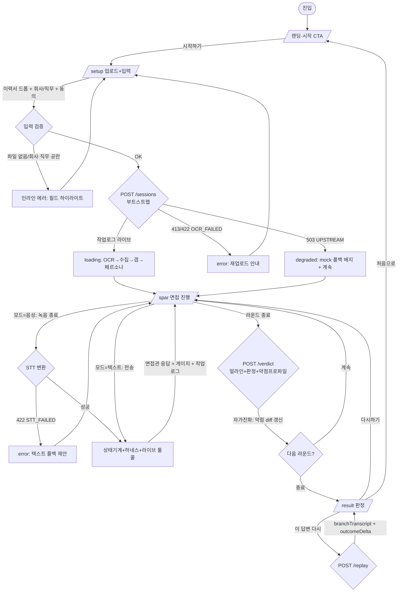

# 02 · User Flow — 면지 (面zy)

> **Source**: PRD §5.5 확장 (분기 조건·에러 경로·자가진화 루프 명시)

## Main Flow (guest 데모 경로)



## Flow A: 음성 면접 1턴 (FR-006·009·010)

```
사용자 발언(녹음) → [녹음 종료]
  → STT 변환 (실패 시 텍스트 폴백)
  → 하네스: set_counterpart_state → (필요시) lookup_job_posting [라이브 툴콜]
  → check_answer_quality → estimate_pass_probability
  → 면접관 응답 (TTS 음성 + 텍스트 말풍선)
  → 작업 로그 패널: 각 스텝 실시간 표시, mock 소스엔 [mock] 배지
  → 합격확률 게이지 업데이트
```

## Flow B: 세션 내 자가진화 (FR-011, C-2 가시화)

```
R1 진행 (2~3턴) → 약점 신호 누적 (예: "두루뭉술" 0.7)
  → 라운드 종료 → update_weakness_profile
  → 작업 로그에 before/after diff:
       "R1: 두루뭉술 0.7 → R2 전략: 정량근거 강제"
  → R2 시작: 면접관 질문 전략 조정 (약점 타겟)
  → 화면: 1R 질문 ↔ 2R 질문 나란히 대비 (무엇이 달라졌나)
```

## Flow C: 분기 리플레이 (FR-016, 데모 클라이맥스)

```
/result 판정 카드 → moments 리스트에서 특정 순간 선택
  → "이 답변 다시" 클릭
  → (옵션) 대안 답변 입력  OR  AI 모범안 생성
  → POST /replay → branchTranscript + outcomeDelta + passProbabilityDelta
  → 원본 vs 분기 전개 좌우 비교, 합격확률 Δ 강조
```

## Error & Degradation Paths (NFR §4.2 graceful degradation)

| 트리거 | 상태 | UI 처리 | 폴백 |
|--------|------|---------|------|
| 마이크 권한 거부 | error | 권한 안내 모달 | 텍스트 모드 전환 |
| STT 실패 (422) | error | "다시 말씀해 주세요" 토스트 | 텍스트 입력 노출 |
| OCR 실패 (422) | error | 재업로드 안내 | 다른 파일/수동 입력 |
| 업스트림 장애 (503) | degraded | `[mock]` 배지 + 진행 | mock 어댑터 |
| 파일 용량 초과 (413) | error | 용량 제한 안내 | 압축/다른 파일 |
| 무효 sessionId | error | 토스트 후 `/`로 | 새 세션 시작 |
